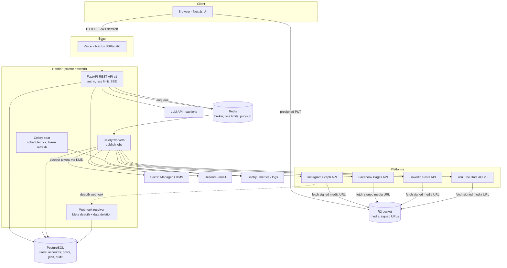

# Phase 2 — Production Architecture

Goals: security (tokens are the crown jewels), reliability (no duplicate/lost posts), extensibility (X/Threads/TikTok/Pinterest later), and operability by a small team.

## 1. Stack decision (justified in docs/07)

| Layer | Choice | Why (short) |
|---|---|---|
| Frontend | Next.js 15 (App Router) on Vercel | Dashboard + marketing site in one, server components for data, first-class auth middleware |
| Backend API | FastAPI (Python 3.12) | Async, Pydantic validation, OpenAPI for free; pairs with Celery |
| Workers | Celery + Redis broker | Mature retries/backoff/beat scheduling; job-per-platform model |
| Database | PostgreSQL 16 (managed) | Relational integrity for tokens/jobs/audit; JSONB for raw API responses |
| Cache/queue | Redis 7 (managed) | Broker + rate-limit counters + SSE pub/sub |
| Object storage | Cloudflare R2 (S3 API) | Zero egress fees (platforms *fetch* your media), S3-compatible abstraction keeps AWS exit open |
| Secrets | Cloud secret manager + KMS envelope encryption | App creds in secret manager; per-user tokens encrypted in DB with KMS-wrapped data keys |
| Email/notifications | Resend (email) + in-app table | Publish failures must reach humans |
| Observability | Sentry + OpenTelemetry + structured JSON logs + Uptime checks | Schedulers fail silently without this |
| Hosting | Render (API + workers + cron) initially; AWS ECS later if needed | Managed Postgres/Redis/workers, low ops; documented exit path |
| CI/CD | GitHub Actions + Snyk (code/SCA/IaC) + gitleaks | Security gates enforced in pipeline — verifiable via Snyk MCP post-build |

## 2. System diagram



## 3. Publish sequence (the critical path)

```mermaid
sequenceDiagram
    participant U as User
    participant A as API
    participant Q as Redis queue
    participant W as Worker
    participant P as Platform API
    U->>A: POST /posts/{id}/publish (Idempotency-Key)
    A->>A: validate targets, check platform quota cache
    A->>Q: enqueue 1 job per platform target (idempotency key)
    A-->>U: 202 Accepted + job ids
    W->>Q: claim job (acks_late)
    W->>W: transition target: queued→publishing (state machine)
    W->>P: publish (IG: container→poll→publish; YT: resumable upload)
    P-->>W: post id / URL / error
    W->>W: encrypt-free write: status, external_post_id, raw response
    W->>A: Redis pub/sub status event
    A-->>U: SSE: target published/failed
    W->>W: on failure: retry w/ exponential backoff + jitter (max 5), else mark failed + notify
```

Idempotency rule: a job first writes `external_post_id` *inside the same DB transaction* as its status transition. A retried job checks for an existing `external_post_id` (and, where supported, queries the platform by client reference) before publishing again. This is what prevents double-posting — treat it as non-negotiable.

## 4. Token security design

1. OAuth exchange happens **only server-side** (confidential client). Browser never sees platform tokens — only your own session cookie (httpOnly, Secure, SameSite=Lax).
2. Encrypt tokens with **AES-256-GCM** using a data-encryption key (DEK); DEK is wrapped by the cloud **KMS** master key (envelope encryption). Store `ciphertext, nonce, key_version`.
3. Rotation: new `key_version` re-wraps DEK; background job re-encrypts rows lazily. Decrypt calls are KMS-audited.
4. Tokens are decrypted **only in workers at call time**, held in memory, never logged. Log scrubbers redact `access_token`-shaped strings defensively.
5. Deauth webhook or 401 from platform → mark account `revoked`, notify user, pause dependent scheduled posts (`requires_action`).
6. Proactive refresh worker (beat, hourly): refresh Meta long-lived/IG tokens near expiry; alert users 7 days before unrefreshable expiries (LinkedIn 60-day).

## 5. Scheduling design

- `post_targets.scheduled_at` stored in **UTC** plus original `timezone` (DST-safe display and editing).
- Celery beat ticks every 60s → dispatcher query: `SELECT ... FROM post_targets WHERE status='scheduled' AND scheduled_at <= now() FOR UPDATE SKIP LOCKED LIMIT 100` → enqueue publish jobs. No far-future broker ETAs (survives broker restarts; horizontally safe).
- Missed window (downtime): dispatcher picks up overdue rows; if overdue > user-configurable threshold (default 2h), mark `requires_action` instead of late-posting.

## 6. Revised database schema (delta from PDF)

```
workspaces(id, name, owner_user_id, plan, created_at)
users(id, email UNIQUE, password_hash NULL, auth_provider, email_verified_at, mfa_secret NULL, created_at, updated_at)
workspace_members(workspace_id, user_id, role)                   -- RBAC: owner/editor/viewer
connected_accounts(id, workspace_id, platform, external_account_id, account_name,
    enc_access_token, enc_refresh_token, nonce, key_version, token_expires_at,
    scopes[], status, last_refreshed_at, created_at, updated_at,
    UNIQUE(workspace_id, platform, external_account_id))
media_assets(id, workspace_id, storage_key, mime_type, bytes, width, height, duration_s,
    checksum_sha256, av_scan_status, exif_stripped bool, thumbnail_key, created_at)
post_drafts(id, workspace_id, created_by, master_caption, status, created_at, updated_at)
post_targets(id, post_draft_id, platform, connected_account_id, caption, title, description,
    privacy, scheduled_at timestamptz, timezone, status, validation_errors jsonb, updated_at,
    INDEX(status, scheduled_at))
publish_jobs(id, post_target_id, idempotency_key UNIQUE, attempts, state, last_error,
    external_post_id, external_url, api_response jsonb, created_at, updated_at,
    INDEX(state, updated_at))
audit_logs(id, workspace_id, actor_user_id, action, entity_type, entity_id, platform,
    request_id, ip, metadata jsonb, created_at)                  -- append-only, no tokens/PII payloads
notifications(id, user_id, type, payload jsonb, read_at, created_at)
webhook_events(id, provider, event_type, payload jsonb, signature_valid bool, processed_at, created_at)
```

## 7. Cross-cutting

- **Rate limiting (inbound):** per-user token bucket in Redis (e.g., 60 req/min API, 10 publishes/min) at middleware; 429 + Retry-After.
- **Rate limiting (outbound):** per-platform budget tracker in Redis; check IG `content_publishing_limit` before enqueue; YouTube daily upload budget counter with hard stop + user-facing quota meter.
- **Caching:** platform account metadata (page lists, channel info) cached 15 min; caption LLM results cached by content hash.
- **Extensibility:** `PlatformPublisher` interface (`validate(target) → prepare(media) → publish(target) → verify(job)`), one adapter per platform, registered in a driver table — X/Threads/TikTok/Pinterest become new adapters + scope rows, no core changes.
- **Notifications:** event bus (Redis pub/sub) → notifier worker → in-app row + email on `published`, `failed_final`, `token_expiring`, `requires_action`.
- **Environments:** dev / staging / prod, each with its **own OAuth apps**, buckets, DBs. Staging is where app-review screencasts are recorded.
- **Deployment:** Docker images, GitHub Actions: lint → typecheck → tests → Snyk code+SCA (fail on high) → gitleaks → build → deploy (Render blue-green); Alembic migrations run as release step, backwards-compatible only.
- **DR/backups:** managed Postgres PITR + daily snapshot, R2 versioning, quarterly restore drill.
